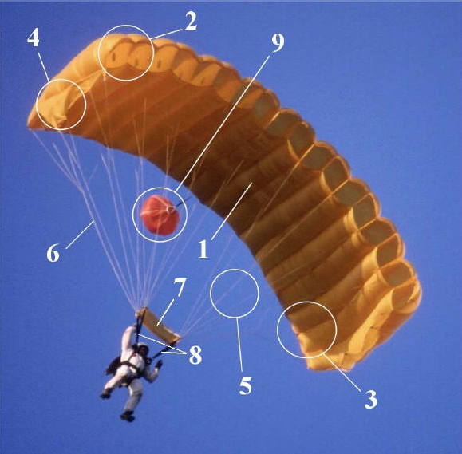
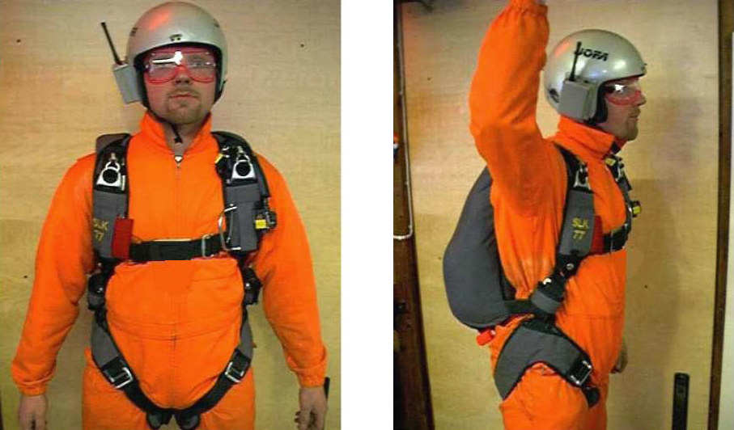

layout: true
name: title
class: middle, center
background-image: url(./tmpl/title_background.png)
background-position: center
background-size: no-repeat
background-size: 100% 100%

---

layout: true
name: title2
class: middle, left

---

layout: true
name: video
class: middle, center

---

layout: true
name: default
background-image: url(./tmpl/left_banner.png)
background-position: top left
background-size: no-repeat
background-size: contain

---
template: title

# TEORIA - LASKUVARJOHYPPÄÄJÄN ALKEISKURSSI

---
template: default

# Tervetuloa taivaalle

* Perustettu vuonna 1919

* Avustamissopimus Ilmailuhallinnon kanssa

* Hoitaa käytännön valvontaa ja koulutusta

* Laskuvarjotoimikunta: Kalustoryhmä, Kilpailukomitea ja Koulutus- ja turvallisuuskomitea

* Termiikkiryhmä

* Ilmailu-lehti

* www.ilmailuliitto.fi

---

# Turvallisuus

* Tavallisin vamma on nilkan nyrjähtäminen

* Hyppääminen tapahtuu aina omalla vastuulla

* Useimmat vapaa-ajan vakuutukset eivät korvaa laskuvarjohyppäämistä

* SIL:n jäsenille tapaturma- ja kolmannen osapuolen vastuuvakuutus

* Vakuutus kannattaa ottaa

* Lisätietoja Hyvä hyppykurssilainen -esitteestä sekä kouluttajilta

---

# TERVEYDENTILAVAATIMUKSET

* Ei suorituskyvyn menetyksen aiheuttavia sairauksia: diabetes, epIIepsia, sydantaudit, huimauskohtaukset, mielenterveyshäiriöt

* Ei aistien tai raajojen vakavia toimintahäiriöitä: huono näkö tai kuulo, olkapään tms. sijoiltaan meno, Vakavat aiemmat selkä- tms. vammat

* Ei suurta ylipainoa: oppilaan suurin sallittu paino 100 kg \(varjokalustosta riippuen\)

* Ei suositella verenluovutusta muutamaan päivään ennen laskuvarjohyppyä

* Laitesukeltajan huomioitava varoajat ennen laskuvarjohyppyä

**ÄLÄ SALAA MITÄÄN VAMMAA, KYSYMYS ON SINUN TURVALLISUUDESTASI.
KOULUTUSORGANISAATIO VOI VAATIA LÄÄKÄRINTODISTUKSEN**

---

**ALKOHOLIN, HUUMEIQEN JA KAIKKIEN VASTAAVIEQI PAIHTEIDEN JA PIRISTEIDEN
KAYTTO ON LASKUVARJOHYPPYTOIMINNASSA EHDOTTOMASTI KIELLETTY! SÄÄNNÖN
RIKKOMISESTA VOI SEURATA ILMAILULAIN, RIKOSLAIN, KERHON
KOULUTUSORGANISAATION JA JOHTOKUNNAN RANGAISTUSTOIMENPITEITÄ**

---

# KENTTAALUEELLA LIIKKUMINEN

* Alue on suljettu asiattomilta, ei siis sinulta

* Kierrä lentokoneet aina takakautta, väistä aina liikkuvaa konetta

* Lentokoneiden lähelle vain kouluttajan opastuksella

I Moottoreiden melu turruttaa, riskitekijä

* Kiitoratoja ei saa ylittää ilman lupaa

---

# MUITA OHJEITA

* Tiivis koulutusohjelma vaatii Sinulta aktiivisuutta ja opetettujen asioiden kertaamista

* Jos jokin asia jää epäselväksi, kysy epäröimättä kouluttajilta

---

# LASKUVARJOHYPPYKOULUTUS

* Sekä teoriaa että käytännön harjoituksia

* Pääpaino on käytännön harjoituksissa

* vaatimuksena 15 vuoden ikä, alle 18-vuotiailta holhoojan suostumus

* Silmälasit eivät ole este

* Alkeiskurssi antaa valmiudet pakkolaukaisuhyppyihin, eli alkeisoppilaan kelpoisuuden

---

# NÄIN ETENET HYPPYURALLASI

* Ensimmäinen hyppy pakkolaukaisuna 1000 metristä I Sitä ennen Iäpäistävä teoriakoe ja käytännön kokeet

* Annettava terveydentilavakuutus jaltai käytävä lääkärissä

* Maksettava kurssimaksu

TODO!!!

---

# OPPILASHYPPYTOIMINNAN EDELLYTYKSET

* Tuuli ei saa olla liian kova, alussa myös tyyni keli voi olla haasteellinen

* Pilvitilanne sopiva oppilashyppytoiminnalle - Esteetön alastuloalue

* Hyvää hyppysäätä joudutaan joskus odottelemaan

---

# HYPPYMESTARI

* Valvoo hyppytoimintaa ja "heittää" oppilaat koneesta

* Tarkastaa varusteesi

* Valvoo ja arvioi suorituksesi

* On henkilö, jolta voit kysyä neuvoa koska tahansa

**AINA ENNEN UUTTA SUORITUSTA SINUN TULEE SAADA MAAKOULUTUS HYPPYMESTARILTA**

---

# LASKUVARJOKALUSTO

---

# REPPU-VALJASYHDISTELMÄ \(WINGS\)

---

# REPPU-VALJASYHDISTELMÄ \(WINGS\)

---

# AAD, KOLMIRENGASLUKKO JA RSL

---

# MUUT VARUSTEET

* Kova kypärä \(radio\)

* Suojalasit

* Haalarit - Korkeusmittari

* Koukkupuukko - sormikkaat  ä - Kengät

* Pelastusliivit \(jos lähistöllä on vesialueita\)

Lisäksi aina ennen hyppyä tarkastetaan aina **hyppypäiväkirja**

---

# HYPPYVARUSTEIDEN KÄS\|TTELY

* Ei saa heitellä

* Ei saa istua päällä

* Ei saa nostaa kantohihnoista, aukaisukahvoista tai vaijereiden suojaputkista

* Ei saa laahata maassa

* Ei saa jättää auringonvaloon eikä sateeseen

* Ei tupakointia Iaskuvarjojen läheisyydessä

* Jos varusteet Iikaantuvat, ilmoita kouluttajalle

**Käsittele hyppyvarusteitasi kunnioituksella**

---

# HYPPYTAPAHTUMA VALMISTAUTUMINEN HYPPYYN

* Henkinen latautuminen

* Riittävä lepo

* Riittävä ravinto

* Varaa varusteet, sovita ne etukäteen - Harjoittele suoritusta, kysy HM:ltä, jos olet epävarma jostakin

* Seuraa muiden hyppyjä, varjolla lentoa ja Iaskeutumisia

* Hyppymestari tarkastaa varusteet ennen koneelle lähtöä

---

# TOIMINTA KONEESSA

* Varo omiasi ja muiden varusteita liikkuessasi koneessa: suojaa Varjojen aukaisukahvoja

* Vältä turhaa liikkumista

* Keskity omaan hyppyyn, älä häiritse muita

* Koneen päällikkö on lentäjä, sinun päällikkösi on hyppymestari

---

# ULOSHYPPY \(Streeva\)

* OVELLE! siirrytään koneen ovelle

* MENE! siirrytään \(varoen repun asumista koneeseen\) streevalle UH-asentoon ja irrottaudutaan koneesta

* Pidetään hyvä X-asento ja taivutus sekä aletaan laskea X, taivutus ja katse ylös koneeseen

* Käsien yhtäaikainen irroittaminen

* Rintamasuunta Ientosuuntaan

* Hyvä ja symmetrinen asentšš

---

# VARJON AVAUTUMINEN \(Pakkolaukaisu\)

* PL-järjestelmä aukaisee päävarjon repun

* Sisäpussi tulee ulos repusta

* Punokset purkautuvat kumilenkeistä ja suoristuvat

* Pääkupu tulee ulos sisäpussista ja alkaa kehittyä

* Slider liukuu alas punoksia pitkin

---

# VARJON LOPULLINEN AVAAMINEN

Varjo lentää, kun:

* Kupu on säännöllisen muotoinen

* Punokset ovat kireällä

* Slider on suorakaiteen muotoinen

* Varjo tarkastetaan YLHÄÄLTÄ ALAS

* Varjo selvitetään ALHAALTA YLÖS

* Puolijarrut saa avata vasta kierteiden poiston jälkeen

---

# OHJAAMINEN

* Tarkkaile ilmatilaa

* Tarkkaile korkeutta

* Tarkasta kahvat

* Tarkasta sijaintisi

* Tarkasta maalialueen sijainti

---

# LENTOTILAT

---

# ILMA- JA MAANOPEUS

---

# TURBULENSSI

* Ilman pyörteisyyttä esim. reunaesteiden takana

* Aiheutuu kovasta tuulesta \(myös termiikistä\)

* Vrt. vene aallokossa, liian kova aallokko voi kaataa veneen, samoin kova turbulenssi keikuttaa varjoa, tai jopa tukahduttaa sen

* Turbulenttisessa kelissä varjoa lennetään täydessä Iiidossa

---

# KÄÄNNÖKSET

* Oikeasta oikealle, vasemmasta vasemmalle
* Käännökset täysiliidosta

* Käännökset puolijarrutuksesta

* Käännökset täysijarrutuksesta

* Ei rajuja ohjausliikkeitä

* EI JYRKKIÄ KÄÄNNÖKSIÄ MATALALLA

**KOKEILE VARJON KÄYTTÄYTYMISTÄ, ÄLÄ PELKÄÄ OHJATA**

---

# LASKEUTUMISKUVIO

---

---

# LASKEUTUMISKUVIO 3D

---

---

# LASKEUTUMISKUVIO KAAVIO

---

# LASKEUTUMISEN TÄRKEYSJÄRJESTYS:

* Suora finaali \(tärkeintä on, ettei varjo ole Iaskeuduttaessa käännöksessä\)

* Tee Ioppuveto aina vähintään puolijarrutustilaan

* Pyri laskeutumaan vastatuuleen, esteettömälle alueelle

** MUISTA AINA LASKEUTUMISEN TÄRKEYSJÄRJESTYS, SE AUTTAA SINUA LASKEUTUMAAN TURVALLlSESTl! **

---

# MAAHANTULO

* Ohjaa varjoa maahan asti

* Kädet ohjauslenkeissä

* Leuka kiinni rinnassa

* Polvetjoustavasti hiukan koukussa, tiukasti yhdessä

* Jalkaterät 45 astetta etenemissuunnasta sivulle, tiukasti hdessä

* Jalkapohjat samalla tasolla ja maanpinnan suuntaiset

* Nosta I laske ohjauslenkit korvien tasolle

---

# LOPPUVETO

* Yhtäjaksoinen terävä veto ohjauslenkeistä täysijarrutukseen

* Aloitus noin 2-3 metrin korkeudessa \(tyynellä säällä hieman ylempänä\)

* Jos varjo pysähtyy liian korkealle, **PIDÄ VARJO TÄYSIJARRUTUSTILASSA!**

* Ole **AINA** valmiina

---

# RADIOKOMENNOT

* Heiluta jalkoja

* Vasen, vasen - suoraan

* Oikea, oikea - suoraan

* Jarruta, jarruta

* Nosta, nosta

* Liidä

* Ohjaa itsenäisesti

* Jalat yhteen - vedä

**RADIO ON VAIN APUVÄLINE, SE VOI RIKKOUTUA!**

---

# LENTÄÄ, EI LENNÄ

* Varjo lentää kun:

  * Kupu on säännöllisen muotoinen

  * Punokset ovat kireällä - Slider on suorakaiteen muotoinen

JOS ET OSAA  LENTÄÄKÖ VARJO VAI EI, **SE EI LENNA!** =&gt; VARAVARJOTOIMENPITEET

---

# LENTÄÄ - SELVITÄ

Slider ylhäällä:

* Pumppaa slider alas

* Tarkkaile korkeutta

---

# LENTÄÄ - SELVITÄ

Slider ylhäällä ja kierrettä :

* Levitä kantohihnoja, potki kierre auki ja pumppaa slider alas

* Tarkkaile korkeutta

---

# LENTÄÄ - SELVITÄ

Reunatunnelit tukossa ja slider ylhäällä:

* Pumppaa slider alas ja tunnelit auki

* Tarkkaile korkeutta

---

# LENTÄÄ - SELVITÄ

Reunatunnelit tu/kosša, slider ylhäällä ja kierrettä punoksissa:

* Levitä kantohihnoja, potki kierre auki, pumppaa slider alas ja tunnelit auki

* Tarkkaile korkeutta

---

# LENTÄÄ - SELVITÄ

Avautumassa oleva varjo: ‘

* Pumppaa kupu tarvittaessa auki

* Tarkkaile korkeutta

---

# LINE OVER - EI LENNÄ

* **TEE VARVARJOTOIMENPITEET**

---

# VARAVARJON KÄYTTÖ

Tärkeät korkeudet:

* 1000 m Uloshyppykorkeus, varjon lopullinen avaaminen

* 600 m Varjon oltava täysin kehittynyt, VV-toimenpiteet viimeistään

* 300 m Alempana ei suositella päävarjon irtipäästöä, **tarvittaessa suoraan varavarjon avaus**

---

# VARAVARJOTOIMENPITEET

* Pidä taivutus

* Tarkasta korkeus

* Katso päävarjon irtipäästöpampulaa, ota kiinni molemmin käsin

* Murra tarra ja vedä kädet suoriksi alaviistoon

* Katso varavarjon kahvaa, ota kiinni molemmin käsin

* Murra tarra ja vedä kädet suoriksi alaviistoon

* Ota delta / X-asento

---

# VARAVARJOTOIMENPITEET

TODO: KAAVIO

---

# VAARATILANTEET HYPPYTOIMINNASSA

VAARATILANTEET KONEESSA JA ULOSHYPYSSÄ

* Repun tahaton aukeaminen koneessa

  * Streeva-koneessa repun tahaton aukeamInen kiipeämisen aikana

* Hätähyppy

* Pakkolasku

* Koneeseen kiinni jääminen

* Apuvarjon aiheuttamat vaaratilanteet

---

# VAARATILANTEET HYPPYTOIMINNASSA

VAARATILANTEET KONEESSA JA ULOSHYPYSSÄ

* Sotkeutuminen punoksiin

* Jos uloshyppysi on huono \(myöhemmässä vaiheessa huono avausasento\), on mahdollista
  sotkeutua punoksiin

* Pyri tällöin irrottautumaan takertuneista punoksista ennen varavarjotoimenpiteitä

* Tarvittaessa käytä koukkupuukkoa

* Tee kuitenkin varavarjotoimenpiteet viimeistään 600 metrissä

---

# VAARATILANTEET VARJON VARASSA

KAKSI VARJOA AUKI - VARJOT PERÄKKÄIN \(biplane\)

* ÄLÄ PÄÄSTÄ PÄÄVARJOA IRTI!

* Ohjaa varovasti etummaista varjoa takimmaisista kantohihnoista

* Vain välttämättömiä ohjausliikkeitä

* Ei loppuvetoa

---

# VAARATILANTEET VARJON VARASSA

KAKSI VARJOA AUKI - VARJOT PERÄKKÄIN \(side by side\)

* ÄLÄ PÄÄSTÄ PÄÄVARJOA IRTI!

* Ohjaa hallitsevaa varjoa varovasti takimmaisista kantohihnoista

* Vain välttämättömiä ohjausliikkeitä

* Ei loppuvetoa

---

# VAARATILANTEET VARJON VARASSA

VARJOT SIVUILLA JA ERILLÄÄN TOISISTAAN \(downplane9

**PÄÄSTÄ PÄÄVARJO IRTI!**

---

# TÖRMÄÄMINEN VARJON VARASSA

**HUUDA VAROITUS, VÄISTÄ OIKEALLE!**

_**Alempana olevalla on aina etuajo-oikeus**_

TÖRMÄYSTILANTEESSA:

* Jarruta vauhti pois

* Käperry "palloksi"

SOTKEUTUMISTILANTEESSA:

* Tarkkaile korkeutta

* Keskustele

* lrrottaudu punoksista ennen irtipäästöä \(käytä tarvittae§§a kqqkkupuukkoa\)

* EI IRTIPAASTOA ALLE 300 m!

---

# LASKEUTUMINEN ERILAISIIN PAIKKOIHIN

* Pyritään välttämään ohjaamalla oikein

* Valitaan ajoissa varalaskupaikka

* Pidetään valittu Iaskeutumissuunnitelma

* Normaalit toimet

  * ohjauskuviot

  * laskeutuminen vastatuuleen

  * alastuloasento

  * loppuveto

---

# HYVÄ PAIKKA

* Pelto
* Urheilukenttä

* Muut aukeat alueet

---

# HUONO PAIKKA

* Vesi

* Metsä

* Asutusalue

* Sähkölinjat \(Näkyvät huonosti ilmasta, tarkkaile tolppien varjoja\)

---

# LASKEUTUMINEN VARAPAIKALLE

Varo sähkölinjoja ja yksittäisiä puita!

LASKUSUUNTA VASTATUULEEN SUHTEESSA AURINKOON - JO ENNEN NOUSUA!

KATSO VASTATUULI SAVUISTA, LIPUISTA, MUISTA HYPPÄÄJISTÄ TMS.

PIDÄ HYVÄ ALASTULOASENTO

---

# HYPPYTAPAHTUMA KOKONAISUUTENA

1. Uloshyppy ja laskeminen

2. Katse koneeseen, taivutus, hyvä Ientoasento, "101...105"

3. Varjon tarkastaminen \(lentää, ei lennä\)

4. Varjon lopullinen avaaminen \(kierteet, slider, tunnelit\)

5. llmatilan tarkastus

   * Tarkkaile säännöllisesti, väistä tarvittaessa oikealle 5. Korkeuden tarkastus

   * Tarkkaile säännöllisesti

6. Kahvat, tarkasta että ovat taskuissaan

7. Sijainti, tarkista oma ja maalialueen sijainti
   4.-7. = IKKS!

---

# ULOSHYPYSTA MAAHANTULOON

1. Käännä varjo tarvittaessa vastatuuleen I Vältät ajautumisen maalialueen päälle

2. Radiokutsuun vastaaminen

   * Heiluta jalkojasi REILUSTI

3. Suunnittele Ientoreittisi Iaskeutumiskuvioiden aloitukseen asti

4. Ohjauskokeilut

   * Käännöksiä eri jarrutustiloissa

   * Kokeile myös Ioppuvetoa

   * Muista korkeuden, ilmatilan ja sijaintisi tarkkailu

   * Vältä rajuja ohjausliikkeitä

5. Varjolla lentelyä tuulisektorilla pysyen

   * Tarkkaile: ilmatila, korkeus, sijaintisi, maalialueen sijainti

   * Muista välietapit ja korkeudenpudotukset

   * Pysyttele tuulilinjan läheisyydessä

   * ÄLÄ ylitä 300 metrin tasaa liian korkealla 

---

# ULOSHYPYSTA MAAHANTULOON

1. Myötätuuliosa

   * Aloita 300 metrin korkeudessa

   * Muista sovittu Iaskeutumiskierroksen suunta

   * Lennä puolijarrutustilassa

   * Tarkkaile ilmatilaa, erityisen tärkeää laskeutumiskuviossa I Seuraa korkeutta, omaa sijaintia

2. Perusosa

   * Aloita 200 metrin korkeudessa

   * Lennä puolijarruilla

   * Älä ylitä maalialueen takarajaa

3. Vastatuuliosa eli finaali

   * Käänny tinaaliin 100 metrin korkeudessa

   * Tarkkaile tuulipussia tai muuta tuulen suunnan ilmaisinta I Ohjaa loppuun asti

---

# ULOSHYPYSTÄ MAAHANTULOON

1. Valmistaudu maahantuloon

   * N. 50 metrin korkeudessa jarrutuksen kevennys

   * Maahantuloasento

   * Radiokomento: JALAT YHTEEN

   * Noin 2-3 metrin korkeudessa, paina ohjausienkit terävästi täysijarrutustilaan \(radiokomennolla: VEDÄ\)

2. Laskeutuminen

3. Muista jalat tiukasti yhdessä ja vartalon alla, ei edessä

4. Tee maahantulokierähdys

5. Tukahduta varjo tarvittaessa

6. Nouse ylös, että radiokouluttaja tietää sinun olevan ok

---

